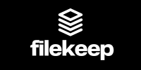

# 📦 FileKeep Ecosystem - John Crickett Coding Challenge

Welcome to the **FileKeep Ecosystem** — a modern, lightweight Dropbox clone built as a solution to the [John Cricket Coding Challenge: Build Your Own Dropbox](https://codingchallenges.fyi/challenges/challenge-dropbox). This monorepo serves as an overview and central hub for all the individual components that make up FileKeep, linking together the **frontend client**, **backend API**, and **local sync application**.

---

## 🧱 Overview

The FileKeep platform is composed of three primary components:

| Component              | Description                                                                                                                  | Repository                                                              |
| ---------------------- | ---------------------------------------------------------------------------------------------------------------------------- | ----------------------------------------------------------------------- |
| 🖥️ **Frontend Client** | A React + TypeScript single-page application (SPA) where users can upload, manage, and share files and folders.              | [filekeep-client](https://github.com/jayastronomic/filekeep-client)     |
| ⚙️ **Backend API**     | A Spring Boot application that handles user data, sync requests, file uploads/downloads, and shareable link generation.      | [filekeep-api](https://github.com/jayastronomic/filekeep-api)           |
| 💻 **Local Sync App**  | A lightweight Ruby + Rack service that runs locally to sync a folder on the user's device with their FileKeep cloud account. | [filekeep-sync](https://github.com/jayastronomic/filekeep-sync-service) |

---

## 🌐 How It Works

FileKeep is designed to function like a simplified cloud drive with optional syncing capabilities:

1. **Frontend (Client App)**  
   Users interact with the client to manage their files and folders visually. Files are uploaded, shared, and organized through the UI.

2. **Backend (API Server)**  
   Handles requests from both the client and the sync app. Stores metadata and files (on S3), provides authentication, and manages shared links.

3. **Sync App (Local Ruby App)**  
    Installed locally by the user. Watches a designated folder and syncs it with their FileKeep cloud account via the backend.
   --

## 🚀 Getting Started

### 1. Start the API Server

Follow the setup instructions in the [filekeep-api](https://github.com/jayastronomic/filekeep-api) repository.

### 2. Start the Client

Follow the setup instructions in the [filekeep-client](https://github.com/jayastronomic/filekeep-client) repository.

### 3. Run the Local Sync App _(optional)_

Install Ruby and follow the setup in the [filekeep-sync](https://github.com/jayastronomic/filekeep-sync-service) repository to sync a local folder to the cloud.

---

## 📌 Objectives

✅ Authentication  
✅ Upload, download, and manage files and folders  
✅ Share items via unique URLs  
✅ Sync local folders with cloud drive
✅ Persistent background syncing  
✅ Built with a modern tech stack (React, Spring Boot, Ruby)

---

## 🔗 Live Demo

You can interact with the FileKeep client directly in your browser:

👉 **[Try FileKeep Live](https://filekeep-web-app.onrender.com)**

> ⚠️ **Important:**
>
> - The sync feature is only available in development environments.
> - You can only upload 10 files per account. Files types can only be text or image.
> - This live demo is **for development and learning purposes only** — **do not upload any sensitive, private, or important files**. It is not a production-ready storage solution.
> - 💤 The demo may take a few moments to load if it hasn't been accessed recently due to cold starts on the host.

---

## 🤝 Contributing

Want to help improve FileKeep? Contributions are welcome in any of the linked repositories. Please submit issues or open a pull request in the relevant project.

---

## 📄 License

All projects in the FileKeep ecosystem are released under the [MIT License](LICENSE).
